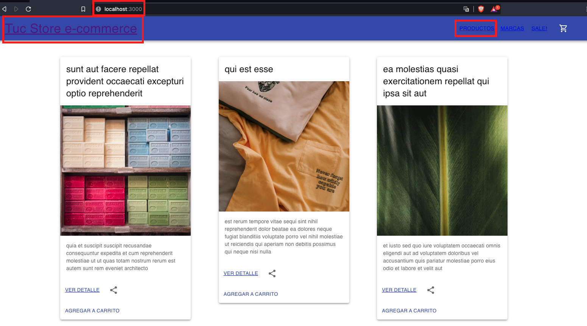
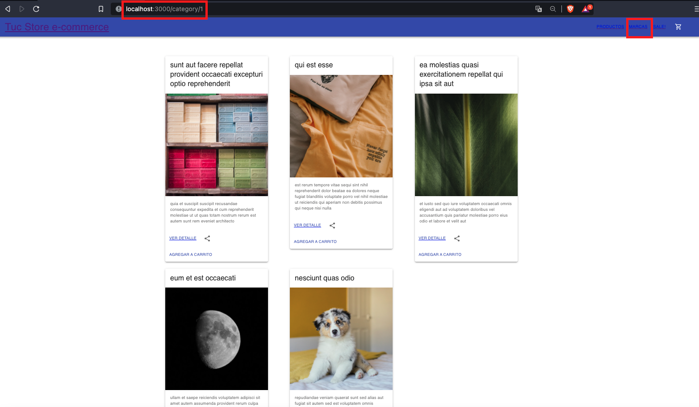
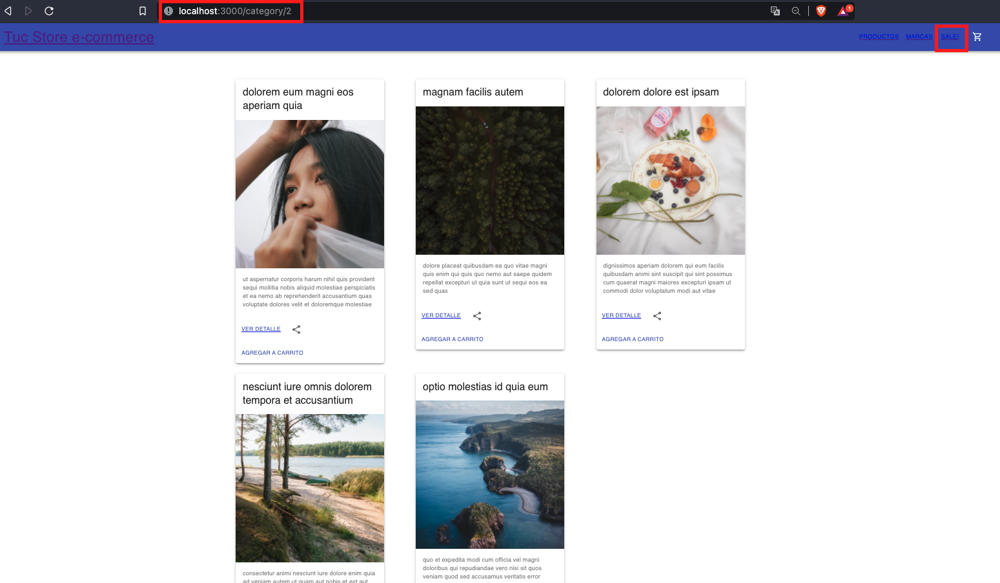
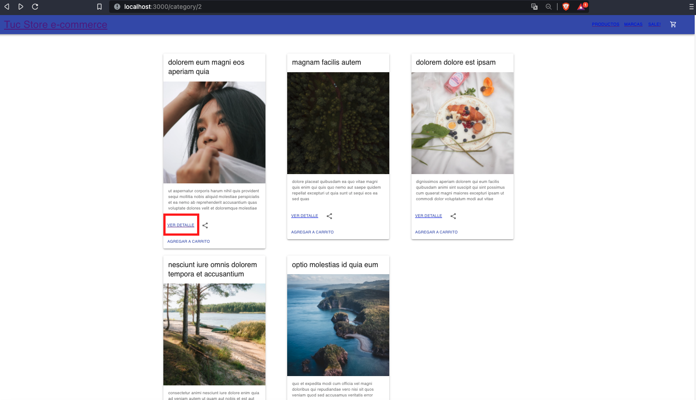
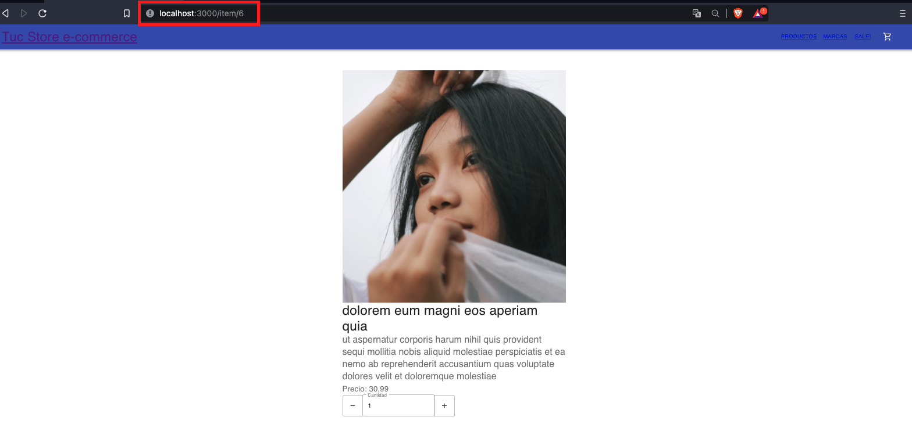

Tuc Store ecommerce - Navegación
======================================

**Intro**
--------
Breve intro de como navegar por la pagina web.

**Levantar aplicación**
--------

Al clonarse el repo, hay se debera correr:

 - npm install
 - npm start 

**Home**
--------
Para ir al home, se puede acceder mediante el nombre de la pagina web situado
en la parte superior izquierda, o se puede acceder mediante el link de "Productos"
en el menu de la parte superior derecha

**Categorias**
--------
Tenemos 2 categorias por ahora:
 
 - Categoria 1 destinado a marcas
   

 - Categoria 2 destinada a ofertas ("Sales")
  

**Items - detalles**
--------

Para ver los detalles de un item en particular, necesitamos clickear en la opcion
"ver detalle"

Una vez hecho click en el detalle, podremos acceder al item, ver su precio y 
seleccionar la cantidad de productos que necesitemos (de acuerdo al stock)

