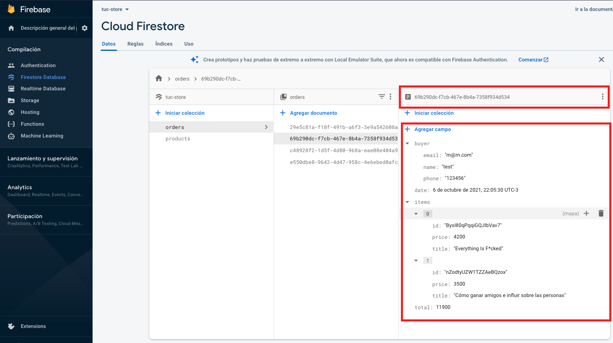

Tuc Book Store
======================================

**Intro**
--------
Tuc Web Store es una aplicación web, con las funcionalidades básicas de un e commers con carrito de compras.

**Tecnologias**
--------
 - ReactJS (17.0.2)
 - Material UI (4.x.x)
 - Firebase Database
 - Firebase Hosting

**Acceso WEB**
--------
La aplicación esta deployada en Firebase hosting.
Estos nos permitira navegar y usar la applicacion si necesidad de instalar software en la maquina local lo que conlleva a errores en librerias y versiones

URL: https://tuc-store.web.app/

**Pre requisitos (para uso local)**
--------
 - Tener instalado node/npm
   - https://nodejs.org/es/download/
 - Tener instalado GIT
   - https://git-scm.com/downloads


**Levantar aplicación local**
--------

Al clonarse el repo, hay se debera correr:

1. Clonarse repositorio: 
```   
git clone git@github.com:magrellet/tuc-store.git
```
2. Instalar dependencias de proyecto
```
 npm install
 ```
3. Correr proyecto
```
 npm start
```
4.  En tu browser de preferencia acceder a: http://localhost:3000/


**Demo**
--------
El siguente GIF representa, a modo demo, una navegacion rápida de la aplicación donde se observan los requisitos:

1. Navegar entre productos y detalles
2. Agregar a carrito producto
3. Visualizar carrito con el listado de la orden y precio
4. Formulario de comprador con nombre, telefono, email y confirmación de email


5. Datos persistidos en la base de datos de firebase (Ver id en imagen)


